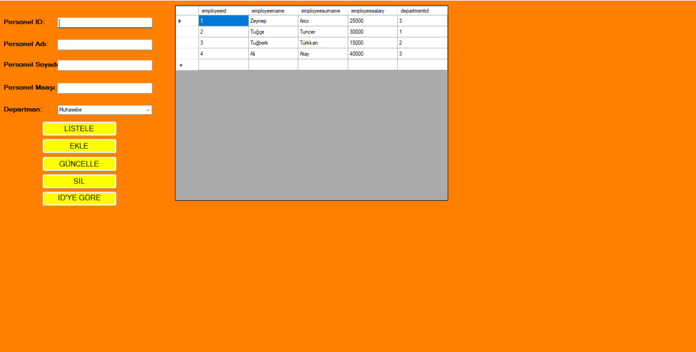
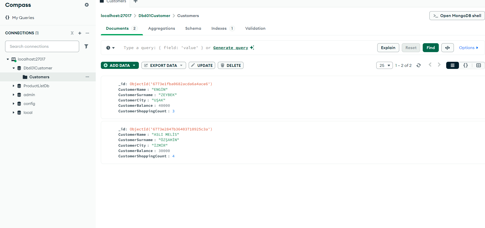
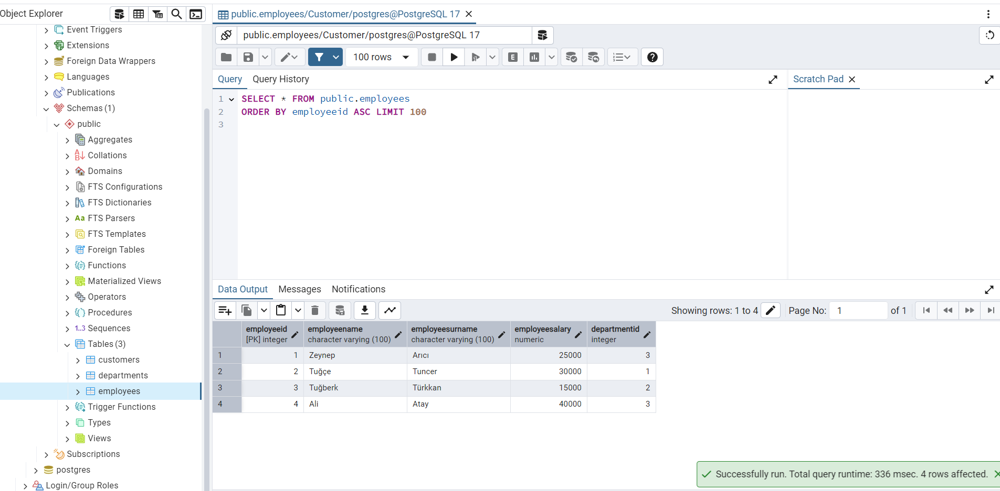

# ☕ CSHARP EĞİTİM KAMPI 601 EĞİTİMİ

Bu eğitim kampında windows form üzerinde **CRUD** işlemlerini uyguladık. **MongoDB** ve **PostgreSQL** kullandık veri tabanı olarak. ORM aracı olarak  **PostgreSQL** için **ADO.NET** kullanarak bu tablodaki verileri form üzerine getirdik.

---

### Kullandığımız teknolojiler

1. Windows form
2. PosgreSQL
3. MongoDB
4. ADO.NET
5. C#

---

---

---

